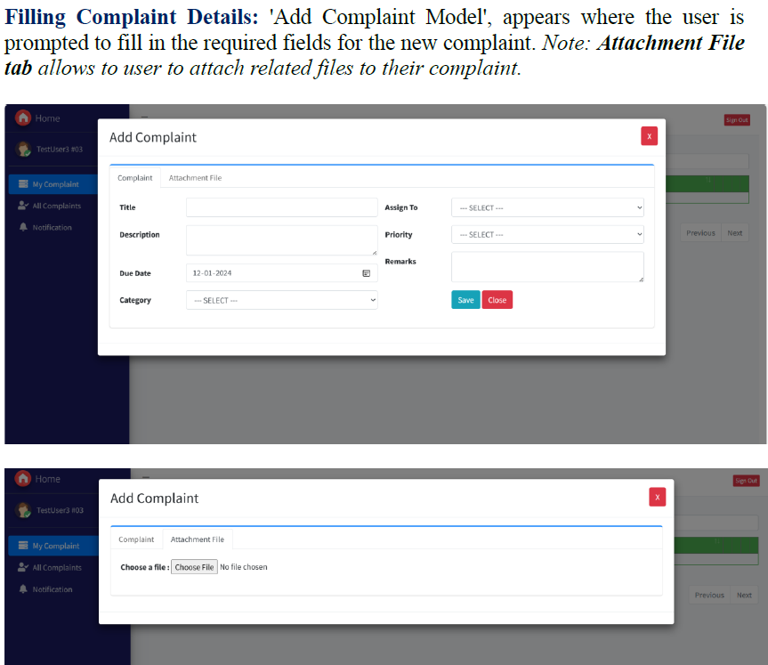

# HelpHive - Complaint Management System Dashboard

Welcome to the HelpHive Complaint Management System Dashboard repository. This project was developed during my internship at Tata Technologies Ltd. and aims to streamline the process of handling customer complaints using ASP.NET Core and MS-SQL.

## Table of Contents

1. [Project Overview](#project-overview)
2. [Key Features](#key-features)
3. [Technologies Used](#technologies-used)
4. [Usage](#usage)
5. [Screenshots](#screenshots)

## Project Overview

HelpHive is a robust solution designed to handle customer grievances efficiently. It features a dual-dashboard interface catering to both complainants and administrative personnel. The system ensures real-time notifications and status updates, fostering transparent and effective resolution processes.

### Key Objectives and Achievements

- Enhance the efficiency of handling customer complaints.
- Provide a user-friendly interface for both customers and admins.
- Implement robust backend processes for secure and scalable operations.
- Ensure real-time updates and notifications to keep all parties informed.

## Key Features

- **User-First Design**: Intuitive interface and straightforward navigation.
- **Code-First Approach**: Flexibility and speed in database schema definition.
- **Responsive Design**: Optimal viewing across a range of devices.
- **Super Admin Capabilities**:
  - Monitor and track all complaints.
  - Review and reopen resolved complaints.
  - Manage user authentication and roles.
  - Dynamically update priority, category, and status settings.
  - View detailed audit logs for system interactions.
  - Manage company information dynamically updated in complaint receipts.

## Technologies Used

- **ASP.NET Core** with MVC Architecture
- **Entity Framework Core** for database management
- **jQuery** and **jQuery DataTables** for front-end interactivity
- **SweetAlert** for custom alerts
- **Microsoft.AspNetCore.Identity.EntityFrameworkCore** for secure user authentication

## Usage

1. **Login Screen**: Enter your credentials to access the dashboard.
2. **Register a Complaint**: Navigate to 'My Complaints' and click 'Add New' to register a complaint.
3. **Manage Complaints**: Admins can view and update complaints from the dashboard.
4. **Super Admin Functions**: Manage users, priorities, categories, statuses, and view audit logs from the Super Admin dashboard.

## Screenshots

